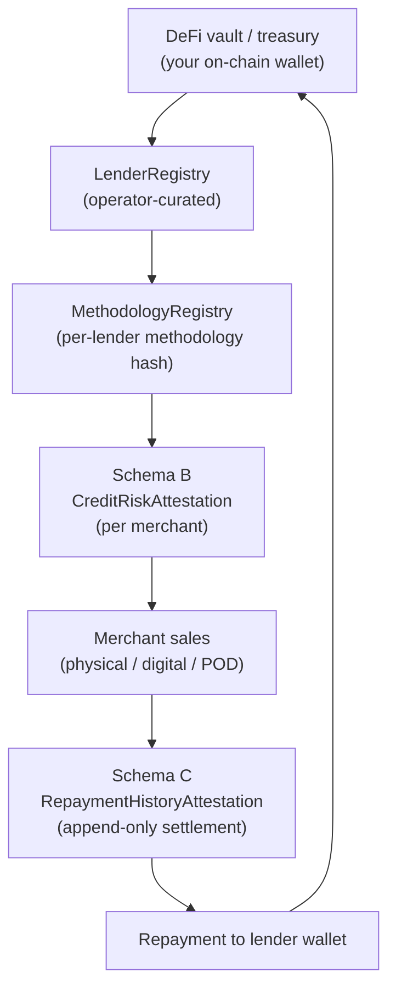

Droplinked sits between **on-chain capital** and **real-world commerce**. If you run
a DeFi vault, a protocol treasury, or a credit-line lending protocol with stable
assets you'd like to deploy into yield-bearing real-economy positions, this page is
the canonical onboarding narrative.

The bridge is three layers:

1. **DeFi capital** — your vault / treasury sits on idle stablecoin or asset reserves
   looking for diversified, non-synthetic yield.
2. **The trust fabric** — droplinked's on-chain attestation layer (EAS Schema v2 — see
   [Trust Fabric](/concepts/trust-fabric)) lets you publish your underwriting
   methodology in a cryptographically verifiable way and issue per-merchant
   credit-risk attestations regulators can independently audit.
3. **Real-world commerce** — droplinked merchants (physical goods, digital, POD,
   in-store retail) generating actual sales — actual cash flow — and therefore actual
   repayments back to your wallet.

The yield is **real repayment streams from real merchant sales**, with full
chain-anchored auditability. Not synthetic yield. Not rehypothecated collateral. Not
a wrapped-up money-market position with a TradFi counterparty risk you can't see.

## Architecture at a glance



Every arrow above is either an on-chain attestation, a registry mutation captured in
an append-only audit log, or a verifiable settlement event. A regulator —
FSRA, SCA, or your jurisdiction's equivalent — can reconstruct the full history of
any underwriting decision you made and any repayment you received without trusting
droplinked.

## Why droplinked?

- **Real-world yield, not synthetic.** Every repayment is anchored to a real
  merchant order on a real PSP (Stripe, PayPal, Telr, Bonum, PayMob). No
  rehypothecation, no second-order DeFi exposure.
- **Cryptographic verifiability.** Every credit-risk decision you issue is an
  on-chain attestation (Schema B) pinning a SHA-256 of the underwriting methodology
  you published. Verifiers re-hash and refuse on divergence.
- **Per-merchant credit-risk granularity.** Underwrite one merchant or one thousand;
  each gets its own Schema B attestation with its own `creditTier` +
  `maxCreditLineUsdCents` + `expiresAt` lifecycle. No portfolio-level smearing.
- **Methodology hash pinning.** You can't silently swap underwriting basis. If you
  publish v2 of your scorecard, old attestations stay pinned to the v1 hash they
  cited at mint time; new mints cite v2. Every divergence is auditable.
- **Audit trail for regulators.** Every registry mutation — lender registration,
  status change, methodology supersession, methodology revocation — lands in an
  append-only audit log preserved by droplinked. Regulators querying the operator
  console can reconstruct any state at any past timestamp.
- **Routing surfaces.** Verified merchants in matching jurisdictions can discover
  you via [`GET /v2/lender-routing/recommend`](/api-reference/public/lender-routing)
  — exact-jurisdiction first, `GLOBAL` fallback. Your jurisdiction is your
  first-mover moat.
- **MCP surface for consumer agents.** ChatGPT / Claude / Cursor / OpenAI Agents
  SDK can discover and recommend you to onboarding merchants directly via the
  [droplinked-mcp server](/agentic/mcp-server). No partner BD required.

## The 4-step onboarding flow

<Steps>
  <Step title="Register your entity in the LenderRegistry">
    The operator console gates lender registration (SUPER_ADMIN). Provide the
    legal entity name, archetype, jurisdiction, signing wallet placeholder, and
    regulator reference. Status starts at `PENDING_KYB`.

    ```bash
    curl -X POST https://apiv3.droplinked.com/admin/lenders \
      -H "Authorization: Bearer $SUPER_ADMIN_JWT" \
      -H "Content-Type: application/json" \
      -d '{
        "lenderId": "your-lender-slug",
        "displayName": "Your Lender (Jurisdiction)",
        "archetype": "defi-vault",
        "jurisdiction": "GLOBAL",
        "signingWallet": "0x0000000000000000000000000000000000000000",
        "regulatorReference": null
      }'
    ```

    **What changes**: a new row in `LenderRegistry` (status `PENDING_KYB`) +
    a `LENDER_REGISTERED` event in `lender-audit-log` (preserved forever).
  </Step>

  <Step title="Publish your underwriting methodology">
    Upload your methodology document (PDF or markdown) to a stable URL — your
    own domain, IPFS, Arweave — and register the SHA-256 hash with droplinked.

    ```bash
    HASH=$(shasum -a 256 ./methodology-v1.pdf | awk '{print $1}')

    curl -X POST https://apiv3.droplinked.com/admin/methodologies \
      -H "Authorization: Bearer $SUPER_ADMIN_JWT" \
      -H "Content-Type: application/json" \
      -d "{
        \"lenderId\": \"your-lender-slug\",
        \"version\": \"1.0.0\",
        \"methodologyHash\": \"$HASH\",
        \"documentUrl\": \"https://yourdomain.example/methodology-v1.pdf\",
        \"displayName\": \"Your Lender — Working-Capital Methodology v1.0\"
      }"
    ```

    **What changes**: a new row in `MethodologyRegistry` (status `ACTIVE`) +
    a `METHODOLOGY_REGISTERED` event in `methodology-audit-log`. From this
    moment on, every Schema B mint by your lenderId cites this hash.
  </Step>

  <Step title="Status flip to ACTIVE">
    Once your KYB is verified by droplinked, the operator flips your status
    to `ACTIVE`. Only ACTIVE lenders can mint Schema B attestations.

    ```bash
    curl -X POST https://apiv3.droplinked.com/admin/lenders/your-lender-slug/status \
      -H "Authorization: Bearer $SUPER_ADMIN_JWT" \
      -H "Content-Type: application/json" \
      -d '{ "newStatus": "ACTIVE", "reason": "KYB verified" }'
    ```

    **What changes**: `LenderRegistry.status` flips to `ACTIVE` + a
    `LENDER_STATUS_CHANGED` event lands in `lender-audit-log`. The
    `EasIssuer.isActive` gate now lets your wallet sign Schema B attestations.
  </Step>

  <Step title="Issue per-merchant credit-risk attestations">
    For each merchant you underwrite, issue a Schema B `CreditRiskAttestation`
    pinning your methodology hash. The on-chain UID becomes the verifiable
    primary key.

    ```bash
    curl -X POST https://apiv3.droplinked.com/v2/attestations/credit-risk \
      -H "Authorization: Bearer $LENDER_JWT" \
      -H "Content-Type: application/json" \
      -d '{
        "merchantId": "6a207db0d29923bffaa983ca",
        "lenderId": "your-lender-slug",
        "creditTier": "T2",
        "maxCreditLineUsdCents": 5000000,
        "methodologyHash": "0xabc123...",
        "expiresAt": "2026-12-31T23:59:59Z"
      }'
    ```

    **What changes**: a new on-chain attestation on Base Sepolia (mainnet
    pending KMS migration). Verifiers can pull it via
    [`GET /v2/attestations/credit-risk/:merchantId`](/concepts/trust-fabric)
    and walk the [forensic chain](/concepts/forensic-chain) back to your
    methodology + your registry profile.
  </Step>
</Steps>

## What verifiers see

Once registered + ACTIVE, your offering is exposed via these public read endpoints —
no JWT, no IP-allowlist:

| Endpoint | Surfaces |
|---|---|
| [`GET /v2/lenders/:lenderId`](/api-reference/public/lender-registry) | Your public profile + signing wallet (verifiers cross-check vs the on-chain `issuerWallet`) |
| [`GET /v2/lenders/:lenderId/timeline`](/api-reference/public/lender-registry) | Your lifecycle history (registered, status changes, metadata updates — operator-only fields redacted) |
| [`GET /v2/lenders`](/api-reference/public/lender-registry) | Your discoverable presence in the public lender list |
| [`GET /v2/methodologies/:lenderId/active`](/api-reference/public/methodology-registry) | The current methodology in force for new Schema B mints |
| [`GET /v2/methodologies/:lenderId/:hash`](/api-reference/public/methodology-registry) | Hash lookup — verifier downloads `documentUrl` + re-hashes for integrity |
| [`GET /v2/methodologies/:lenderId/versions`](/api-reference/public/methodology-registry) | Your full methodology lineage (ACTIVE + SUPERSEDED + REVOKED, newest-first) |
| [`GET /v2/methodologies/:lenderId/:hash/timeline`](/api-reference/public/methodology-registry) | Per-version lifecycle (registered → superseded → revoked, redacted) |
| [`GET /v2/trust-fabric/stats`](/api-reference/public/trust-fabric-stats) | Your jurisdiction's aggregate weight in the trust fabric |

## Agent surface (MCP)

Consumer agents — ChatGPT, Claude, Cursor, OpenAI Agents SDK — call these tools on
the [droplinked-mcp server](/agentic/mcp-server) and surface you to onboarding
merchants automatically:

| Tool | How this surfaces your offering |
|---|---|
| [`verify_lender`](/agentic/lender-trinity-mcp-tools) | Agent resolves a `lenderId` from a Schema B attestation back to your human-readable profile |
| [`recommend_lender`](/agentic/lender-trinity-mcp-tools) | Agent answering "which lenders should this merchant approach?" — you appear ranked by jurisdiction-match + track record |
| [`verify_methodology`](/agentic/lender-trinity-mcp-tools) | Agent confirms an attestation cites a real, published methodology you registered |
| [`get_lender_history`](/agentic/lender-trinity-mcp-tools) | Agent walks your lifecycle to confirm you were ACTIVE at attestation mint time |
| [`get_methodology_timeline`](/agentic/lender-trinity-mcp-tools) | Agent walks a methodology's lifecycle to confirm it wasn't already revoked / superseded at mint time |
| [`get_methodology_versions`](/agentic/lender-trinity-mcp-tools) | Agent walks your full methodology lineage when no specific hash is in hand |
| [`get_trust_fabric_stats`](/agentic/lender-trinity-mcp-tools) | Agent gauges platform scale (and your jurisdiction's share) before recommending you |

## Audit-trail commitment

<Note>
**Every registry mutation produces an append-only audit-log entry preserved by
droplinked**. The two logs (`lender-audit-log` + `methodology-audit-log`) are
write-only at the operator console — there is no delete path. Regulators querying
the operator console can reconstruct any state at any past timestamp. Methodology
document tampering is provably detectable because the SHA-256 hash is on-chain at
mint time: a verifier downloads `documentUrl`, re-hashes, and refuses on divergence.
</Note>

## Status semantics

### LenderRegistry status

| Status | Meaning | Can mint Schema B? | Verifier policy |
|---|---|---|---|
| `PENDING_KYB` | Registered but droplinked KYB not complete | No | Refuse |
| `ACTIVE` | KYB verified, fully operational | Yes | Honor |
| `SUSPENDED` | Temporarily de-listed (operator decision) | No new mints | Honor existing per policy, flag |
| `ARCHIVED` | Permanently de-listed | No | Honor existing per policy, flag |

### MethodologyRegistry status

| Status | Meaning | New mints cite this? | Verifier policy |
|---|---|---|---|
| `ACTIVE` | Currently in force | Yes | Honor |
| `SUPERSEDED` | Lender published a newer version | No | Honor historical attestations issued before `supersededAt` (methodology was in force at the time) |
| `REVOKED` | Operator pulled the methodology | No | Red flag — refuse pending review |

The reconciler cron (every 6h) mirrors `LenderRegistry.status` onto every ACTIVE
Schema B attestation via the `lenderCurrentStatus` + `lenderCurrentStatusAt`
fields. The reconciler **never auto-revokes** an attestation; it only mirrors. See
[Trust Fabric — Issuer-state mirroring](/concepts/trust-fabric#issuer-state-mirroring)
for the full semantics.

## Reference dashboard

You can embed the trust-fabric scale + your own activity in your own internal portal
or partner-facing UI. See the
[Trust-Fabric Dashboard Template](/guides/integrations/trust-fabric-dashboard-template)
for a drop-in copy-pastable HTML + JavaScript implementation (vanilla JS and React
flavors) that polls `/v2/trust-fabric/stats` + the public lender list.

## Verifier integrity recipe

The canonical 3-step verifier flow any regulator or counter-party will run:

1. **Read the on-chain Schema B attestation** —
   `GET /v2/attestations/credit-risk/:merchantId`. Pin `attestationUid`,
   `lenderId`, `issuerWallet`, `methodologyHash`, `occurredAt`.
2. **Resolve the methodology hash** —
   `GET /v2/methodologies/:lenderId/:methodologyHash`. Pull `documentUrl` +
   `status` + `effectiveAt`.
3. **Re-hash the document** —
   `curl -sLo /tmp/methodology.pdf $DOC_URL && shasum -a 256 /tmp/methodology.pdf`.
   Compare against the on-chain `methodologyHash`. Any divergence is methodology
   tampering and the attestation must be refused.

See [Forensic Chain Workflow](/concepts/forensic-chain) for the full end-to-end
walkthrough including lender + repayment-history cross-checks.

## Operator gates

<Warning>
**Actual onboarding is operator-gated (SUPER_ADMIN).** The endpoints in the
4-step flow above are admin-only — droplinked's operator console executes them on
your behalf after verifying your KYB packet.

To start, contact `support@droplinked.com` with:

- Legal entity name + corporate jurisdiction
- Regulator reference (FSRA / SCA / equivalent license number, or N/A if DeFi vault)
- Methodology document URL (https:// or ipfs://) — must be stable + immutable
- Signing wallet address (EVM, 20-byte) — this is the wallet that will sign Schema B
  attestations and the address you'll receive repayments at
- Archetype: `fsra-licensed` / `defi-vault` / `generic`
- Jurisdiction: ISO 3166-1 alpha-2 (e.g. `AE`, `SG`, `US`) or `GLOBAL` for
  unrestricted DeFi vaults

Mainnet is currently gated on the KMS-backed signer migration. Onboarding can
proceed against Base Sepolia testnet today; mainnet flip is operator-coordinated.
</Warning>

## Related

- [Trust Fabric (EAS Schema v2)](/concepts/trust-fabric) — 4-axis architecture overview
- [Forensic Chain Workflow](/concepts/forensic-chain) — end-to-end verifier walkthrough
- [Lender Registry Lookup](/api-reference/public/lender-registry) — `/v2/lenders/*` reference
- [Methodology Registry Lookup](/api-reference/public/methodology-registry) — `/v2/methodologies/*` reference
- [Trust-Fabric Stats](/api-reference/public/trust-fabric-stats) — `/v2/trust-fabric/stats` reference
- [Lender Trinity MCP Tools](/agentic/lender-trinity-mcp-tools) — agent-callable wrappers
- [Trust-Fabric Dashboard Template](/guides/integrations/trust-fabric-dashboard-template) — drop-in HTML + JS reference
