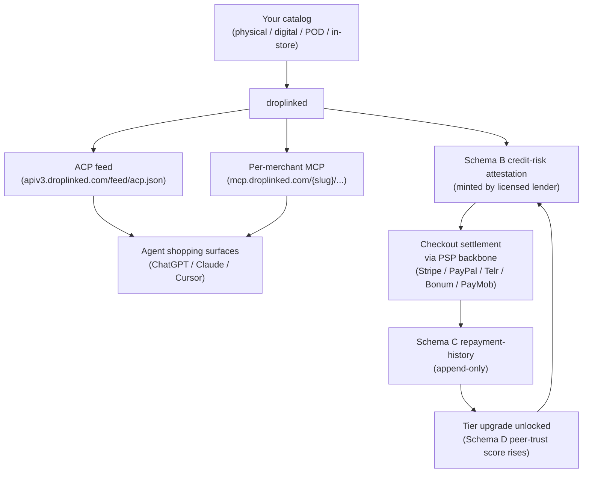

Droplinked is what you reach for when a Shopify-plus-Stripe stack stops being enough.
You already have a catalog. You already have customers. What you don't have —
unless you bolt it on yourself, one vendor at a time — is access to **real
verifiable credit**, a **multi-PSP backbone** that works across every corridor your
buyers actually shop from, an **agent-discoverable surface** for the ChatGPT /
Claude / Cursor shopping wave, and a **chain-anchored audit trail** you can hand to
a regulator or a new payment partner without three weeks of forensic work.

That's the merchant side of the trust fabric. Lenders plug in from one side
(see [DeFi Lender Onboarding](/concepts/for-defi-lenders)); merchants plug in from
the other. The two meet in the middle on real settlement against real cash flow.

This page is the practical hands-on narrative: what you gain, how onboarding flows,
what stays private, and what you explicitly **don't** have to build yourself.

## What you gain

<CardGroup cols={2}>
  <Card title="Verifiable credit lines" icon="hand-holding-dollar">
    Licensed lenders (FSRA, SCA, DeFi vaults) issue per-merchant Schema B
    credit-risk attestations pinned to a published underwriting methodology.
    Collateral-light, regulator-auditable.
  </Card>
  <Card title="Multi-PSP backbone" icon="network-wired">
    One integration → checkout routes through Stripe, PayPal, Telr, Bonum, or
    PayMob depending on the buyer's corridor. You don't pick — the resolver does.
  </Card>
  <Card title="Agent-shoppable distribution" icon="robot">
    Your catalog flows to the ACP feed and a per-merchant MCP endpoint. ChatGPT,
    Claude, Cursor, and the OpenAI Agents SDK can discover and transact against
    your storefront with zero extra wiring.
  </Card>
  <Card title="Privacy-aware verifier surface" icon="shield-halved">
    Operator + verifiers see the attestation envelope. PII (legal entity name,
    banking info, contact details) never leaves the operator console. Public
    verifier endpoints return only chain-anchored claims.
  </Card>
  <Card title="Upgrade paths via repayment history" icon="arrow-trend-up">
    Schema C repayment-history attestations accumulate every settlement event.
    Tier rises as performance accrues. `GET /v2/upgrade-preview` projects
    points-to-next-tier in real time.
  </Card>
  <Card title="Append-only audit trail" icon="clock-rotate-left">
    Every status change, attestation mint, and repayment event is preserved. You
    can prove your good standing to a regulator or a new partner without
    excavating ticket archives.
  </Card>
</CardGroup>

## Architecture at a glance



Each arrow is either an on-chain attestation, a registry mutation captured in an
append-only audit log, or a verifiable settlement event. You — and any regulator
or new partner — can reconstruct the full trajectory without trusting droplinked.

## Onboarding flow

<Steps>
  <Step title="Sign up + publish your catalog">
    Standard droplinked platform onboarding at
    [droplinked.com](https://droplinked.com). Same flow you'd expect from a
    Shopify-style platform: shop slug, branding, product import, payout wallet
    or bank details. This is the existing platform layer — no trust-fabric work
    yet.
  </Step>

  <Step title="Verify your storefront surfaces">
    Confirm your catalog is flowing into the agent-discoverable surfaces.

    ```bash
    # ACP feed entry for your shop
    curl -s "https://apiv3.droplinked.com/feed/acp.json" \
      | jq '.[] | select(.shop_slug == "your-shop-slug")'

    # Per-merchant MCP manifest
    curl -s "https://mcp.droplinked.com/your-shop-slug/manifest.json"
    ```

    If you run a custom storefront, add the
    [`<meta name="mcp-url">` advertisement tag](/agentic/storefront-mcp-discovery)
    to your HTML head so consumer agents auto-discover your MCP endpoint.
  </Step>

  <Step title="Apply for a credit line">
    Submit a lending application. droplinked's
    [`/v2/lender-routing/recommend`](/api-reference/public/lender-routing)
    surface picks the right-jurisdiction lender for your corridor — exact match
    first, `GLOBAL` fallback.

    ```bash
    curl -s "https://apiv3.droplinked.com/v2/lender-routing/recommend?jurisdiction=AE" \
      | jq '.recommended[]'
    ```

    The lender underwrites you against their published methodology, mints a
    Schema B `CreditRiskAttestation` pinning the methodology hash, and the
    `EasIssuer.isActive` gate enforces that only currently-ACTIVE lenders can
    sign.
  </Step>

  <Step title="Settle, repay, upgrade">
    Sales settle through the
    [checkout-intent-resolver](/api-reference/public/checkout-intent-resolver) —
    one of the 5 PSPs handles the authorization based on your buyer's corridor.
    Repayments against your credit line are recorded as Schema C
    `RepaymentHistoryAttestation` events (append-only). Tier rises as your
    repayment record accrues — query
    [`GET /v2/upgrade-preview`](/api-reference/public/upgrade-preview) any time
    for the projection.
  </Step>
</Steps>

## What verifiers see about you

<Note>
The public verifier surface **never** exposes operator-only fields. A regulator
querying [`GET /v2/lenders/:lenderId/timeline`](/api-reference/public/lender-registry)
about a lender that underwrote you sees only event types + status diffs — never
the actor, the reason text, or any PII. The same redaction policy applies to
methodology timeline endpoints and to the public credit-risk attestation
endpoint.

Walk the full verifier sequence in
[Forensic Chain Workflow](/concepts/forensic-chain) to see exactly what fields a
counter-party can re-derive from chain + public reads alone.
</Note>

## Multi-PSP from one wire

| PSP | Coverage | Tier |
|---|---|---|
| Stripe | Global backbone — every merchant inherits | T1 |
| PayPal | Global backbone — PayPal-branded checkout | T1 |
| Telr | MENA / GCC corridor | T2 |
| Bonum | Mongolia / GCC corridor | T2 |
| PayMob | Egypt / MENA corridor | T2 |

You don't see this complexity at integration time. Your checkout calls the
[checkout-intent-resolver](/api-reference/public/checkout-intent-resolver) and
the resolver picks the optimal authorized PSP per transaction based on your
buyer's location, currency, and your authorized-PSP pool. Customer-facing
buttons surface payment-method categories (Credit Card / PayPal / BNPL / Crypto)
— never PSP brand names — except where the brand IS the method (PayPal,
Apple Pay).

## Discoverability — MCP + ACP

Agent shopping isn't a future surface. It's already live:

| Surface | Endpoint | What agents do here |
|---|---|---|
| Per-merchant MCP | `mcp.droplinked.com/{your-shop-slug}/...` | Inventory queries, cart construction, checkout intent creation |
| ACP feed | `apiv3.droplinked.com/feed/acp.json` | Catalog-wide discovery for shopping agents |
| Storefront advertisement | `<meta name="mcp-url">` in your custom storefront `<head>` | Auto-discovery for agents browsing your domain |

See [Storefront MCP Discovery](/agentic/storefront-mcp-discovery) for the
advertisement-tag pattern and
[Connect Your Store](/agentic/connect-your-store) for the per-shop onboarding
flow.

## Upgrade preview

Tier promotion is mechanical. As your Schema C repayment-history attestations
accumulate, the rollup at
[`GET /v2/upgrade-preview`](/api-reference/public/upgrade-preview) returns:

- Your **current credit tier** (T1 / T2 / T3 / T4)
- **Points-to-next-tier** based on cumulative repayment volume + on-time rate
- **What unlocks** at the next tier (max credit-line uplift, additional lender
  eligibility, lower-friction routing)

The trust-fabric reconciler runs every 6 hours, mirroring lender +
service-provider current status onto active attestations via the
`lenderCurrentStatus` / `attestorCurrentStatus` fields. **The reconciler never
auto-revokes** — see
[Trust Fabric — Issuer-state mirroring](/concepts/trust-fabric#issuer-state-mirroring).

## Audit visibility — for you

<Note>
You can request your full activity log via the operator. The log captures:

- LenderRegistry / MethodologyRegistry status changes that affect your active
  attestations
- Every Schema B credit-risk attestation mint targeting your `merchantId`
- Every Schema C repayment-history event linked to your settlements
- Tier promotion + projection deltas surfaced by
  [`GET /v2/upgrade-preview`](/api-reference/public/upgrade-preview)

The log is append-only at the operator console (no delete path). You can hand a
slice of it to a regulator, a new lender, or a new fulfillment partner without
needing droplinked's continued cooperation.
</Note>

## Privacy commitment

<Warning>
**PII never leaves the operator console.** Legal entity name, contact details,
banking info, KYB documents — none of it surfaces on `/v2/lenders/*`,
`/v2/methodologies/*`, or the public credit-risk attestation endpoint. Public
verifier reads return only aggregate identifiers + chain-anchored claims.

The recently-shipped `merchant-attestation-policy` enforces privacy-aware reads
inside agent-callable inventory tools too — agents querying your shop see
shoppable claims, never operator-only metadata. This is enforced at the policy
layer, not just by convention.
</Warning>

## What you DON'T have to do

- **Integrate 5 PSPs individually** — one droplinked integration covers Stripe,
  PayPal, Telr, Bonum, PayMob. The resolver picks per transaction.
- **Build a custom credit-application UI** — `/v2/lender-routing/recommend`
  returns ranked lenders for your jurisdiction. Use droplinked's routing.
- **Build agent-shoppable plumbing yourself** — the per-merchant MCP server +
  ACP feed are platform-shared infrastructure.
- **Run your own brand attestation infrastructure** — Schema A
  (`BrandAttestation`) is platform-shared. Your shop slug inherits the
  verifiability without you minting anything.
- **Negotiate jurisdiction-by-jurisdiction with lenders** — the
  [LenderRegistry](/api-reference/public/lender-registry) + routing surface
  abstract that work away.

## Comparison vs. traditional commerce platforms

| Capability | Shopify + Stripe | Droplinked |
|---|---|---|
| Credit access | Stripe Capital (US/UK/CA only, opaque scoring) | Verifiable Schema B from any registered lender, methodology-pinned, jurisdiction-routed |
| Multi-PSP routing | Single PSP per shop; multi-PSP requires custom build | 5 PSPs from one integration, resolver picks per transaction |
| Agent shoppability | Custom MCP / API work per shop | Per-merchant MCP + ACP feed live by default |
| Audit verifiability | Vendor-side logs only; regulator must trust the vendor | On-chain attestations + append-only registry audit log; regulator verifies without trusting droplinked |
| Onboarding speed | Weeks per PSP, weeks per credit product | Single platform onboarding; PSPs + credit unlock as you go |

## Related

- [Trust Fabric (EAS Schema v2)](/concepts/trust-fabric) — 4-axis architecture overview
- [Forensic Chain Workflow](/concepts/forensic-chain) — end-to-end verifier walkthrough
- [DeFi Lender Onboarding](/concepts/for-defi-lenders) — the lender side of this story
- [Upgrade Preview](/api-reference/public/upgrade-preview) — `/v2/upgrade-preview` reference
- [Checkout Intent Resolver](/api-reference/public/checkout-intent-resolver) — multi-PSP routing reference
- [Lender Routing](/api-reference/public/lender-routing) — `/v2/lender-routing/recommend` reference
- [Connect Your Store](/agentic/connect-your-store) — per-shop agent-onboarding flow
- [Storefront MCP Discovery](/agentic/storefront-mcp-discovery) — `<meta name="mcp-url">` advertisement pattern
