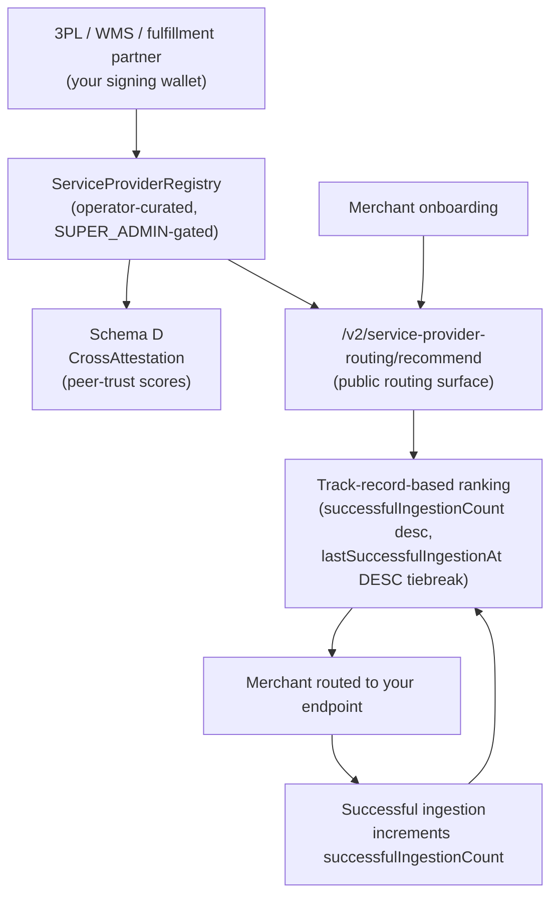

Droplinked sits between **on-chain trust** and **real-world fulfillment**. If you run
a 3PL, a WMS, or a broader fulfillment partner — Stord, Flowspace, ShipBob, or a
regional operator — this page is the canonical onboarding narrative for plugging
into droplinked as a merchant-discovery channel and a Schema D peer-trust issuer.

The value exchange is three-sided. Verified merchants onboarding on droplinked need
a fulfillment partner. The operator routes them to ACTIVE service providers in your
archetype, ranked by track record. Every successful ingestion increments your
`successfulIngestionCount` — your rank compounds with usage rather than decaying
with time. Meanwhile, your registered entity becomes an authorized Schema D issuer:
you can attest other entities in the trust fabric (other SPs, lenders, the
merchants you've directly worked with) and surface those peer-trust signals into the
multi-axis dossier consumer agents pull.

The yield is **operator-curated routing to qualified merchants + chain-anchored
reputation that compounds + an attestation-issuance surface no industry directory
offers**. Not a directory listing that decays. Not paid placement. A track-record
ranking that improves every time you successfully onboard a merchant routed your way.

## What you gain

<CardGroup cols={2}>
  <Card title="Operator-curated merchant routing" icon="route">
    Verified merchants discover you via `/v2/service-provider-routing/recommend` — a public
    routing surface that ranks ACTIVE SPs by archetype + track record. No paid placement.
  </Card>
  <Card title="Schema D peer-trust issuance" icon="signature">
    Your registered signing wallet becomes an authorized issuer of Schema D
    `CrossAttestation`s — peer-trust scores on other entities in the trust fabric.
  </Card>
  <Card title="Track-record-based ranking" icon="trophy">
    `successfulIngestionCount` increments on every successful merchant ingestion.
    The more merchants you onboard, the higher you rank in the next routing pass.
  </Card>
  <Card title="Audit-verified reputation" icon="shield-check">
    Every lifecycle event lands in `service-provider-audit-log` — append-only,
    operator-curated, regulator-readable. Your track record is not a marketing claim.
  </Card>
  <Card title="Append-only compliance trail" icon="scroll">
    Status changes, metadata edits, ingestion-count bumps — all preserved forever.
    Regulators querying the operator console reconstruct any state at any past timestamp.
  </Card>
  <Card title="MCP agent discovery" icon="robot">
    Consumer agents (ChatGPT, Claude, Cursor) call `recommend_service_provider` and
    surface you directly to onboarding merchants — no partner BD required.
  </Card>
</CardGroup>

## Architecture at a glance



Every node above is either a registry mutation captured in an append-only audit
log, an on-chain attestation, or a public read endpoint a verifier can hit without
trusting droplinked. A regulator querying via the operator console can reconstruct
the full lifecycle of any service provider in scope — every status flip, every
metadata edit, every counter increment — at any past timestamp.

## Why droplinked vs. direct sales?

Traditional 3PL discovery is a slow, fragmented BD slog. Each merchant prospect
requires its own outreach, pricing conversation, security-questionnaire pass, and
slow trust-building. Industry directories list you statically with no track-record
signal. Operator-curated discovery on droplinked is structurally different:

- **Direct outreach**: per-merchant BD effort, fragmented integration, slow
  trust-building. Reputation lives in salesperson lore, not in a verifiable record.
- **Industry directories**: static listings, no track-record signal, paid placement
  distorts rank, no chain-anchored proof of successful onboardings.
- **Droplinked**: one operator-curated integration surfaces you to many qualified
  merchants. Your chain-anchored reputation accrues with every successful
  ingestion. Consumer agents recommend you autonomously via MCP.

The discovery surface is one integration. The reputation surface is on-chain and
append-only. Both compound.

## The 3-step onboarding

<Steps>
  <Step title="Register your entity in the ServiceProviderRegistry">
    The operator console gates SP registration (SUPER_ADMIN). Provide the
    legal entity name, archetype (`stord` / `flowspace` / `shipbob` / `generic`),
    jurisdiction, and signing wallet that will sign Schema D attestations.

    ```bash
    curl -X POST https://apiv3.droplinked.com/admin/service-providers \
      -H "Authorization: Bearer $SUPER_ADMIN_JWT" \
      -H "Content-Type: application/json" \
      -d '{
        "providerId": "your-sp-slug",
        "displayName": "Your SP (Region)",
        "archetype": "stord",
        "jurisdiction": "US",
        "signingWallet": "0x0000000000000000000000000000000000000000"
      }'
    ```

    **What changes**: a new row in `ServiceProviderRegistry` (status `PENDING_KYB`)
    + a `SERVICE_PROVIDER_REGISTERED` event in `service-provider-audit-log`
    (preserved forever).
  </Step>

  <Step title="Status flip to ACTIVE">
    Once your KYB is verified by droplinked, the operator flips your status
    to `ACTIVE`. Only ACTIVE SPs appear in the public routing surface and
    only ACTIVE SPs can mint Schema D attestations.

    ```bash
    curl -X POST https://apiv3.droplinked.com/admin/service-providers/your-sp-slug/status \
      -H "Authorization: Bearer $SUPER_ADMIN_JWT" \
      -H "Content-Type: application/json" \
      -d '{ "newStatus": "ACTIVE", "reason": "KYB verified" }'
    ```

    **What changes**: `ServiceProviderRegistry.status` flips to `ACTIVE` + a
    `SERVICE_PROVIDER_STATUS_CHANGED` event lands in
    `service-provider-audit-log`. The `EasIssuer.isActive` gate now lets your
    wallet sign Schema D attestations, and you become discoverable via
    `/v2/service-provider-routing/recommend`.
  </Step>

  <Step title="Start ingestion">
    Merchants routed to you via the recommendation surface integrate with your
    ingestion endpoint. On each successful onboarding, the operator increments
    `successfulIngestionCount` + stamps `lastSuccessfulIngestionAt`. Your rank
    in the next routing pass rises.

    No request from you — the counter is operator-controlled signal, not
    self-reportable. The append-only audit log captures every increment.
  </Step>
</Steps>

## What verifiers see

Once registered + ACTIVE, your offering surfaces via these endpoints:

| Endpoint | Visibility | Surfaces |
|---|---|---|
| `GET /admin/service-providers/:providerId` | SUPER_ADMIN-gated | Full admin profile (signing wallet, contact, ingestion counter, status, archetype, jurisdiction) |
| `GET /admin/service-providers/:providerId/timeline` | SUPER_ADMIN-gated | Full unredacted lifecycle (registered → status changes → metadata edits → ingestion increments) |
| [`GET /v2/service-provider-routing/recommend?archetype=stord`](/api-reference/public/service-provider-routing) | Public, read-only | Your discoverable presence — ranked by `successfulIngestionCount` desc, ties broken by most-recent successful ingestion |

<Note>
**Why no public `GET /v2/service-providers/:id` endpoint?** Partner SPs interact
with you via the **routing layer**, not a direct lookup. Merchants don't browse
SPs by id; they receive an ordered list filtered by archetype. The admin profile
endpoints are SUPER_ADMIN-gated because the underlying record carries operator
notes + contact metadata that isn't intended for public surface. Schema D
attestations you issue are the public-readable artifact tying you to other
entities — that's the verifier-readable trust signal.
</Note>

## Schema D peer-trust attestation

Schema D is the trust fabric's **peer-trust axis**. Any registered + ACTIVE entity
in the trust fabric — service providers, lenders, eventually merchants — can attest
any other entity with a 0–100 trust score + a free-form basis explaining why.

```typescript
// Conceptual Schema D mint via SDK (operator-coordinated for now)
{
  subject: 'flowspace-us-east',          // the entity you're attesting
  subjectType: 'service-provider',
  issuer: 'stord-us-east-1',             // you
  trustScore: 87,                        // 0-100
  basis: 'Co-handled 12 Q2 fulfillment overflow batches without exception.',
  expiresAt: '2027-06-13T00:00:00Z'
}
```

The mint lands as a `CrossAttestation` on the [Ethereum Attestation
Service](https://attest.org) (currently Base Sepolia testnet; mainnet pending KMS
migration). The attestation is append-only — supersession is via a new mint
referencing the prior `attestationUid`, never via in-place edit. Every divergence
between a marketing claim and an on-chain mint is provably detectable.

Schema D outputs feed:

- [`GET /v2/attestations/cross/subject/:rootUid`](/concepts/trust-fabric) — all peer-trust
  attestations *about* a given entity
- [`GET /v2/attestations/cross/issuer/:rootUid`](/concepts/trust-fabric) — all peer-trust
  attestations *issued by* you
- The MCP `get_trust_dossier` tool — composite multi-axis trust dossier consumer
  agents pull when underwriting or recommending counter-parties

See [Trust Fabric — the 4 axes](/concepts/trust-fabric#the-4-axes) for how Schema D
sits alongside Schemas A (brand), B (credit-risk), and C (repayment-history).

## Routing rank — how track record turns into discovery

The routing surface ranks ACTIVE SPs in two passes:

1. **Archetype match** — if the query includes `?archetype=stord`, only SPs with
   `archetype === 'stord'` are eligible. Without a filter, all archetypes compete.
2. **Track-record sort** within the eligible set:
    - **Primary**: `successfulIngestionCount` desc — proven track record first.
    - **Tiebreak**: `lastSuccessfulIngestionAt` desc — most-recent success wins ties.

Newcomers compete on archetype-match first (you'll always rank against your peers
in your archetype, not against unrelated SPs). Then track record. A new SP with
zero ingestions ranks below an established SP in the same archetype until the first
successful ingestion lands; from there, every successful ingestion bumps your
ranking.

The counter is **operator-controlled signal** — increments fire from the operator
console on confirmed successful onboardings, not from a self-reportable callback.
That's deliberate. Self-reported metrics decay into noise; operator-curated metrics
keep the routing surface useful to merchants.

## Admin audit visibility

<Note>
**Every lifecycle event on your row is preserved in `service-provider-audit-log`**.
Status flips (`PENDING_KYB` → `ACTIVE` → `SUSPENDED` → `ARCHIVED`), metadata edits
(display name, jurisdiction, contact notes, signing wallet rotation),
ingestion-count increments — all append-only, all reconstructable. The operator
console can replay any past state at any past timestamp. Regulators querying via
the operator have full visibility. There is no delete path.
</Note>

## MCP agent surface

Consumer agents — ChatGPT, Claude, Cursor, OpenAI Agents SDK — call the
`recommend_service_provider` tool on the [droplinked-mcp
server](/agentic/mcp-server) and surface you directly to onboarding merchants
without partner BD:

```typescript
const recs = await mcp.callTool('recommend_service_provider', {
  archetype: 'stord',
  limit: 5,
});
```

```json
{
  "archetype": "stord",
  "count": 1,
  "recommendations": [
    {
      "providerId": "stord-us-east-1",
      "displayName": "Stor'd US-East",
      "successfulIngestionCount": 47,
      "lastSuccessfulIngestionAt": "2026-06-11T14:30:00Z",
      "rank": 1
    }
  ]
}
```

Pair `recommend_service_provider` with [`verify_brand_attestation` +
`verify_credit_risk`](/concepts/trust-fabric#mcp-tool-surface) for the full
forensic chain — confirm a merchant's brand + credit-risk posture before
investing onboarding cycles in them.

<Note>
The MCP tool catalog is currently published under
[/agentic/lender-trinity-mcp-tools](/agentic/lender-trinity-mcp-tools) for
historical reasons — the page covers both lender + service-provider recommendation
tools (`recommend_lender` + `recommend_service_provider`) on the same MCP server.
</Note>

## Operator gates

<Warning>
**Actual onboarding is operator-gated (SUPER_ADMIN).** The endpoints in the 3-step
flow above are admin-only — droplinked's operator console executes them on your
behalf after verifying your KYB packet.

To start, contact `support@droplinked.com` with:

- Legal entity name + corporate jurisdiction
- Regulator / accreditation references (any IATA, ISO 9001, SOC 2, GDP / GxP, FDA
  registrations relevant to your archetype)
- Signing wallet address (EVM, 20-byte) — this is the wallet that will sign
  Schema D `CrossAttestation`s
- Archetype: `stord` / `flowspace` / `shipbob` / `generic`
- Jurisdiction: ISO 3166-1 alpha-2 (e.g. `US`, `AE`, `SG`) or `GLOBAL` if you serve
  unrestricted geography
- Ingestion endpoint integration spec — your existing webhook / API contract so
  the operator can wire merchants routed to you straight into your pipeline

Mainnet for Schema D mints is currently gated on the KMS-backed signer migration.
Routing-surface discovery + ingestion-counter accrual are live today; on-chain
attestation issuance proceeds against Base Sepolia testnet until the mainnet flip.
</Warning>

## Comparison vs traditional 3PL discovery channels

| Channel | Discovery model | Track-record signal | Reputation surface | Cost |
|---|---|---|---|---|
| **Direct outreach** | Per-merchant BD | None (lives in CRM notes) | Sales testimonials | High BD overhead, slow |
| **Industry directories** | Static listing | None (or self-reported) | Paid placement distorts | Listing fee, low intent |
| **Droplinked** | Operator-curated routing surface | `successfulIngestionCount` (operator-controlled) | Chain-anchored Schema D + audit log | One integration, compounds with usage |

The asymmetry is structural. Direct outreach scales linearly with BD headcount.
Directory listings are a one-time fee for a static surface. Droplinked routing
compounds: every successful onboarding raises your rank for the next merchant in
your archetype, and every Schema D attestation you issue makes you a more weighty
node in the trust fabric.

## Related

- [Trust Fabric (EAS Schema v2)](/concepts/trust-fabric) — 4-axis architecture overview
- [DeFi Lender Onboarding](/concepts/for-defi-lenders) — sibling onboarding guide for the credit-risk axis
- [Merchants on Droplinked](/concepts/for-merchants) — sibling guide for the merchant side of the marketplace
- [Service-Provider Routing](/api-reference/public/service-provider-routing) — `/v2/service-provider-routing/recommend` reference
- [Lender Trinity MCP Tools](/agentic/lender-trinity-mcp-tools) — covers `recommend_service_provider` + sibling tools
- [Forensic Chain Workflow](/concepts/forensic-chain) — end-to-end verifier walkthrough
