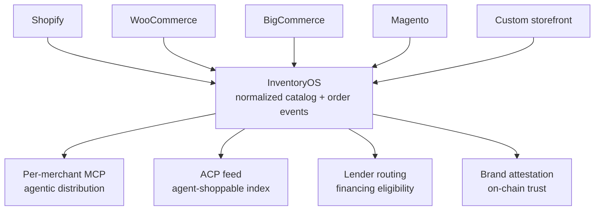

InventoryOS is droplinked's **catalog + inventory bridge layer**. It mirrors your existing commerce platform's catalog into a normalized droplinked-internal representation that the rest of the droplinked stack — agentic distribution, the trust fabric, the LenderRegistry — reads against. You don't move products, customers, or checkouts; you mirror the catalog and order events that drive distribution and underwriting decisions.

The mirror is **one-way** (your platform stays the source of truth) but **reflective**: stock-level updates, product create/update/delete events, and order events flow into droplinked so the agentic and financing surfaces stay current with what your storefront actually shows. Conflict resolution always falls back to the origin platform for price, title, description, and stock — droplinked annotates the mirror with attestation pointers and agent-shoppable metadata.

This bridge unlocks four downstream capabilities — **MCP agent surfaces**, **ACP feed inclusion**, **brand attestation** (Schema A), and **lender-routing eligibility** (Schema B) — without your team re-platforming. The connector pattern generalizes across Shopify (live today), WooCommerce, BigCommerce, Magento, and any custom storefront that can emit webhooks.

## The normalized layer model

InventoryOS sits between origin commerce platforms and the droplinked-side surfaces that consume normalized catalog + order data.



The same normalized representation feeds every droplinked-side reader. Adding a new platform adapter means writing one webhook receiver — every downstream surface inherits the new source automatically.

## What InventoryOS stores per merchant

For each connected merchant, InventoryOS persists a thin, distribution-oriented slice of catalog + order state:

- **Normalized product catalog** — titles, descriptions, variants, images, vendor, tags, SKU
- **Stock levels** — reflective; the origin platform stays the source of truth, droplinked never authoritatively claims a unit you didn't tell us about
- **Recent order events** — for [Schema C repayment-history](/concepts/trust-fabric) attribution + affiliate tracking + agent-source revenue attribution
- **Connection metadata** — origin platform domain, webhook secret hash, last-sync timestamp, signing-validation mode
- **Trust-fabric pointers** — Schema A attestation UID, current lender associations (Schema B), current methodology hash, repayment-history rollup

The normalized product record looks approximately like this — the same shape regardless of whether it came from Shopify, WooCommerce, BigCommerce, Magento, or a custom adapter:

```json
{
  "droplinkedMerchantId": "mch_…",
  "originPlatform": "shopify",
  "originId": "gid://shopify/Product/9876543210",
  "shopSlug": "your-shop-slug",
  "title": "Carbon Hoodie",
  "description": "…",
  "vendor": "Your Brand",
  "tags": ["hoodie", "carbon"],
  "variants": [
    { "originVariantId": "…", "sku": "CARBHOOD-M", "size": "M", "price": { "currency": "USD", "amount": 4900 }, "stock": 42 }
  ],
  "images": ["https://cdn.example.com/carbhood.jpg"],
  "trustFabric": {
    "brandAttestationUid": "0xattest…",
    "currentLenderIds": ["crediblex-uae"],
    "currentMethodologyHash": "0xmeth…"
  },
  "lastSyncedAt": "2026-06-13T12:00:00Z"
}
```

## What InventoryOS does NOT store

By design, InventoryOS stays out of surfaces that are already owned by the origin platform or by another droplinked subsystem:

- **Customer PII** — names, addresses, account history all stay on the origin platform
- **Payment credentials** — card data, PSP secrets, and tokenization stay with the PSP backbone
- **Origin-platform admin data** — reports, analytics, app installs, theme content
- **Custom-app data** — apps installed on Shopify (or any other origin) keep their data on the origin

The smaller the InventoryOS surface area, the simpler the privacy + revocation posture downstream.

## The connector pattern

Every platform adapter follows the same shape:

- **Webhook receivers** for product `create` / `update` / `delete`, inventory-level updates, and order events
- **Bulk sync** for backfill — pages through the origin platform's catalog API (when OAuth is available) to mirror products that pre-date the webhook subscription
- **HMAC (or platform-equivalent) validation** on every inbound webhook — Shopify and WooCommerce use SHA256 HMAC, BigCommerce uses signed JWT, Magento uses RSA signing
- **Idempotent upserts** keyed on the origin-platform product ID — replays and retries don't double-write
- **Conflict resolution** — origin platform wins on price / title / description / stock; InventoryOS annotates the mirror with attestation pointers and agent-shoppable metadata

Each connector ships as its own ingestion endpoint + signing-validation module:

- [Connect Shopify](/agentic/connect-shopify) — live today; the most fully-built reference
- [Connect WooCommerce, BigCommerce, Magento, or custom](/agentic/connect-other-platforms) — same pattern, per-platform webhook setup
- [Connect your store (generic shape)](/agentic/connect-your-store) — platform-agnostic surface

## Order events + attribution

Order webhooks do more than reconcile stock — they're how droplinked attributes agent-sourced revenue and how Schema C repayment-history accrues.

When an order webhook lands at InventoryOS, the event records the order ID, the items + variants, and a **buyer-source tag** that controls attribution:

- **From MCP / agent** — revenue attributes back to the discovering agent + any upstream affiliate, settled via x402 on the 70/20/10 split
- **From storefront direct** — standard order; no agent attribution, no affiliate cut
- **From ACP feed buyer surface** — ACP attribution path, settles via Stripe ACP

The buyer-source tag is set at order-create time by the surface that originated the conversion — the per-merchant MCP stamps `mcp-agent` on `start_checkout` invocations, the ACP buyer surface stamps `acp`, and any other path defaults to `direct`. The order webhook from the origin platform carries this tag forward in metadata (Shopify `note_attributes`, WooCommerce `meta_data`, BigCommerce custom fields, etc.) so InventoryOS doesn't need to guess the source after the fact.

A normalized order event in InventoryOS looks roughly like this:

```json
{
  "droplinkedMerchantId": "mch_…",
  "originPlatform": "shopify",
  "originOrderId": "gid://shopify/Order/123456789",
  "shopSlug": "your-shop-slug",
  "occurredAt": "2026-06-13T12:00:00Z",
  "buyerSource": "mcp-agent",
  "agentId": "agent_chatgpt_…",
  "affiliateId": "aff_…",
  "items": [
    { "originVariantId": "…", "sku": "CARBHOOD-M", "quantity": 1, "price": { "currency": "USD", "amount": 4900 } }
  ],
  "totals": { "currency": "USD", "subtotal": 4900, "tax": 392, "shipping": 800, "grand": 6092 },
  "settlement": { "psp": "stripe", "settlementId": "py_…", "lenderId": null }
}
```

The same order event also feeds the **Schema C repayment-history attestation** when the merchant has an active credit line: the settlement ID, amount, and lender are recorded against the merchant's append-only repayment record, which drives [tier upgrades](/api-reference/public/upgrade-preview) over time. Refunds and chargebacks emit their own append entries — repayment history is full event-log, not just net.

## Reading from InventoryOS

Downstream droplinked-side surfaces never query the origin platform directly — they read from the InventoryOS mirror. This keeps the read path uniform regardless of origin and shields the origin's rate budget from agent traffic.

- **Per-merchant MCP tools** — `search_products`, `get_product`, `list_shop_products`, `start_checkout` all read from the merchant's InventoryOS slice scoped to their `shopSlug`
- **[ACP product feed](/agentic/acp-feed) builder** — the nightly + on-update build pages through every connected merchant's InventoryOS catalog and emits a normalized ACP item per variant, published as the delimited artifacts an ACP ingester reads (`acp/latest.tsv.gz`, `.tsv`, `.jsonl`) and as the JSON catalogue API at `apiv3.droplinked.com/feed/acp.json`
- **Lender-routing recommendation** — `GET /v2/lender-routing/recommend` reads the merchant's InventoryOS activity (revenue volume, channel mix, repayment streak) to weight lender ordering
- **Underwriting signals** — `GET /v2/underwriting-signals/:merchantId` composes Schema B + Schema C reads from the trust-fabric pointers stored on the InventoryOS record
- **Affiliate attribution** — order events carry the `buyer-source` tag forward, and the affiliate-network worker reads order events from InventoryOS to settle x402 payouts

Same normalized record, every reader.

## Trust-fabric tie-in

InventoryOS is the activity feed that the [trust fabric](/concepts/trust-fabric) reads against to decide what's claimable:

- **Schema A — brand attestation.** Operator-curated KYB. A brand attestation becomes claimable once InventoryOS has roughly 30 days of consistent catalog activity from the same merchant (so the brand-slug binding has a meaningful track record).
- **Schema B — credit-risk attestation.** Methodology-hashed at mint time. When a lender underwrites a merchant, the methodology hash from the published [MethodologyRegistry](/api-reference/public/methodology-registry) entry is pinned into the on-chain attestation alongside the credit-tier.
- **Schema C — repayment-history attestation.** Accrues append-only from order events flowing into InventoryOS. Every settled order against an active credit line adds to the merchant's rolling repayment record.
- **Tier projection.** [`GET /v2/upgrade-preview?merchantId=...`](/api-reference/public/upgrade-preview) reads InventoryOS-tracked activity (revenue volume, repayment streak, attestation age) to project what the next financing tier requires.

## Cross-channel reconciliation

The headline payoff of treating InventoryOS as a **bridge** rather than another silo: a single merchant can connect **multiple origin platforms** and get one unified droplinked-side posture.

- A merchant selling on Shopify + WooCommerce + a custom Next.js site can connect all three to InventoryOS
- **Single repayment-history** accrues across all channels — Schema C rolls up settlement events from every connected origin
- **Single lender-routing decision** based on combined activity — the lender sees the merchant's full revenue picture, not just one channel
- **Single agentic distribution surface** — one per-merchant MCP, one ACP feed entry, one brand-slug
- **Brand attestation issued once** — Schema A binds the brand-slug to the merchant wallet and applies to every connected channel

This is the operator-strategic bet behind InventoryOS: financing decisions and agentic discovery should reflect a merchant's full commercial footprint, not a single-platform slice of it.

## Operational characteristics

A few properties of the InventoryOS layer that matter when you're wiring it up:

- **Idempotent ingestion.** Every webhook is keyed on `(originPlatform, originId, eventType, occurredAt)`. Replays from the origin platform — Shopify's webhook retry policy, WooCommerce's re-fire, BigCommerce's at-least-once delivery — collapse to a single mirror state without double-counting.
- **Eventual consistency, bounded.** Per-merchant order-event lag from origin-platform write to InventoryOS visibility is typically sub-second; the cap is the origin platform's webhook delivery SLA. The reconciler cron sweeps every 6h to catch any missed events via the origin's catalog API.
- **Backfill is explicit.** Webhooks only carry events from the moment they're subscribed forward. Initial-catalog backfill runs against the origin platform's catalog API (paged products connection on Shopify, REST `/products` on WooCommerce, V3 catalog on BigCommerce, REST `/V1/products` on Magento) — kicked from the connect endpoint, async for large catalogs.
- **Per-merchant rate-limits.** InventoryOS shields the origin platform from the agent traffic on the droplinked side — agent reads hit the InventoryOS mirror, not the origin's API. Your origin-platform rate budget stays yours.
- **Audit-trail retention.** Order events and attestation pointers are append-only — even on connector revocation, the historical record is retained for verifier-side audit. See the privacy callout below for the revocation-vs-deletion split.

## Privacy + control

<Note>
  Customer PII stays on the origin platforms. InventoryOS sees only catalog + order metadata — the SKUs, totals, settlement IDs, and buyer-source tags needed for attribution and Schema C attestation. No customer profiles, no shipping addresses, no payment data.

  Merchants can revoke any connector at any time. Revocation pauses the corresponding mirror (no new events ingested) but does not delete historical data — Schema C is an append-only audit trail, and droplinked retains the historical record for compliance and verifier-side audit, in line with the rest of the [trust fabric](/concepts/trust-fabric).
</Note>

## What's coming

A realistic roadmap — what's live today is the Shopify connector + the InventoryOS internal layer; these are the next adapters and surfaces, in roughly the order we'll ship them:

- **WooCommerce connector** — Q3 2026, WordPress plugin for one-click install on top of the webhook-config dance
- **BigCommerce connector** — official BigCommerce App Marketplace listing
- **Magento 2.x connector** — Magento extension with RSA-signature verification parity
- **Custom-storefront SDK** — `@droplinked/connector-sdk` covering REST + GraphQL helpers for arbitrary platforms (Next.js, React, Express, Rails, Django)
- **Two-way sync opt-in** — per-field push of droplinked-side annotations (attestation badges, agent-revenue tags, lender-tier callouts) back into origin-platform admin notes

## FAQ

<AccordionGroup>
  <Accordion title="Is InventoryOS a re-platforming layer?">
    No. InventoryOS is strictly additive — a one-way mirror that reads from your origin platform via webhooks. Your storefront, checkout, customer accounts, and admin all stay on the origin platform. You can revoke any connector at any time and the origin keeps working unchanged.
  </Accordion>
  <Accordion title="What happens if I connect multiple origin platforms for the same brand?">
    They roll up into one droplinked-side merchant. One brand-slug, one Schema A attestation, one per-merchant MCP, one ACP feed entry, one lender-routing posture. Order events across all origins accrue to the same Schema C repayment-history record. See [Cross-channel reconciliation](#cross-channel-reconciliation) above.
  </Accordion>
  <Accordion title="Does droplinked ever push back into the origin platform?">
    Not today — every connector is one-way (origin → InventoryOS). Two-way sync is on the roadmap (opt-in, per-field) so droplinked-side annotations like attestation badges, agent-revenue tags, and lender-tier callouts can flow back into origin-platform admin notes. Your origin catalog and pricing stay yours.
  </Accordion>
  <Accordion title="What's the difference between the per-merchant MCP and the ACP feed?">
    Both are agentic-distribution surfaces, both read from InventoryOS, but they serve different agent shapes. The **per-merchant MCP** is interactive — agents call tools (`search_products`, `get_product`, `start_checkout`) scoped to one shop. The **ACP feed** is index-shaped — a single JSON document with every connected merchant's items, ingested in bulk by agentic shopping surfaces (ChatGPT shopping, Claude commerce surfaces) for discovery. A merchant inherits both automatically on connect.
  </Accordion>
  <Accordion title="How is customer PII handled across connectors?">
    InventoryOS never receives customer PII. Order events carry only the fields needed for attribution and Schema C attestation — settlement ID, totals, item lines, buyer-source tag. Customer names, addresses, and payment data stay on the origin platform.
  </Accordion>
</AccordionGroup>

## Related

- [Connect your Shopify store](/agentic/connect-shopify) — the live, fully-built reference adapter
- [Connect WooCommerce, BigCommerce, Magento, or custom](/agentic/connect-other-platforms) — same pattern, per-platform webhook setup
- [Connect your store](/agentic/connect-your-store) — platform-agnostic connect surface
- [Storefront MCP Discovery](/agentic/storefront-mcp-discovery) — advertise your per-merchant MCP URL from your storefront `<head>`
- [Trust fabric](/concepts/trust-fabric) — Schema A/B/C/D attestation architecture
- [For merchants](/concepts/for-merchants) — how droplinked composes with your existing commerce stack
- [Lender Routing Recommendation](/api-reference/public/lender-routing) — pick the right lender by jurisdiction
- [Trust Fabric Statistics](/api-reference/public/trust-fabric-stats) — public rollup of verified-brand counts and credit-attestation volumes
