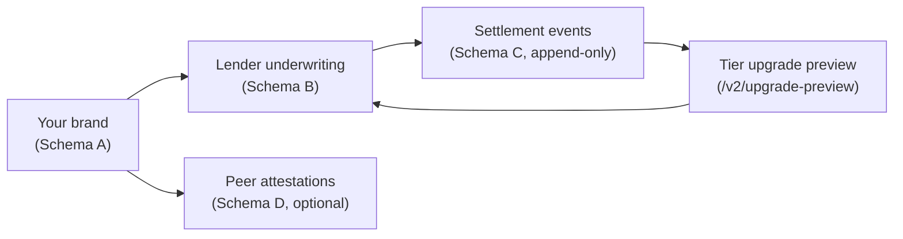

The Trust Fabric is the on-chain record of who you are, who has underwritten you, and how you have performed. It is the **distribution + financing backbone** that sits behind every Droplinked merchant — you do not run it, but every brand verification, credit-line offer, and lender association you receive flows through it.

This page is the merchant-side concept tour. For the developer reference (UIDs, ABI types, copy-pasteable read examples), see the [EAS Schemas group](/api-reference/public/eas-schemas/overview).

## What the Trust Fabric is

Four [Ethereum Attestation Service](https://attest.org) schemas, registered on **Base mainnet** at the predeploy `0x4200…0021`. Each one is a different axis of verifiable signal:

| Axis | Schema | What it proves | Mainnet UID |
|---|---|---|---|
| **A — Entity** | Brand | This brand slug controls these on-chain credentials. | `0xf16f…e5a3` |
| **B — Writer** | Credit-risk | A registered lender has underwritten this merchant for a credit-line. | `0xbd65…c7bd` |
| **C — Reader** | Repayment-history | Append-only settlement record per lender. | `0x090a…f24c` |
| **D — Reconciler** | Cross / peer | Any registered entity attests another with a score + basis. | `0xb076…554e` |

Full hex UIDs and the per-schema reference pages: [Schema A](/api-reference/public/eas-schemas/schema-a-entity), [Schema B](/api-reference/public/eas-schemas/schema-b-writer), [Schema C](/api-reference/public/eas-schemas/schema-c-reader), [Schema D](/api-reference/public/eas-schemas/schema-d-reconciler).

Read the flow as: **A** anchors your identity → **B** is a lender's verdict on you → **C** is the append-only evidence of how that verdict performs → **D** lets peers (WMS, 3PL, partners) cross-sign you. Every arrow is a public, verifier-callable record.

## What you get out of it

<CardGroup cols={3}>
  <Card title="Brand verification" icon="badge-check">
    A Schema A attestation tied to your shop slug. Buyers and lenders read it to confirm the brand behind the catalog.
  </Card>
  <Card title="Credit-line eligibility" icon="hand-holding-dollar">
    Registered lenders read your Schema A + sales history and decide whether to mint a Schema B credit-risk attestation. That attestation is your ticket into the capital markets marketplace.
  </Card>
  <Card title="Tier upgrades over time" icon="arrow-trend-up">
    Every settlement event accrues to your Schema C rollup. Strong repayment lifts you up the AAA → CCC ladder, which lenders read when re-pricing your next line.
  </Card>
</CardGroup>

## The four surfaces you touch

| Surface | Where in the dashboard | What it does |
|---|---|---|
| **Brand attestation** | Trust Fabric card → "Request brand attestation" | Opens a request form. On operator approval, a Schema A attestation is minted from the issuer wallet. |
| **Credit line** | [`/finance/lending`](https://shop.droplinked.com/finance/lending) | Apply for an underwriting assessment. Approved applications mint a Schema B attestation tied to the cited methodology. |
| **Repayment history** | Auto-recorded — no merchant action | Every settlement event hits Schema C as an append-only row. Drives [`/v2/upgrade-preview`](/api-reference/public/upgrade-preview). |
| **Lender associations** | [`/finance/lending/positions`](https://shop.droplinked.com/finance/lending/positions) | View the lenders that currently underwrite you, plus their methodology and current status. |

The brand-attestation lifecycle (request → operator review → on-chain mint → public read) is documented step-by-step in the [Brand Attestation Lifecycle](/guides/trust-fabric/brand-attestation-lifecycle) guide.

## Trust tiers — AAA to CCC

Your **attestation-coverage tier** is the share of your settled orders that are covered by a Schema C repayment-history row. Lenders read this directly when pricing your next line. The bands are operator-locked:

| Tier | Coverage | Band |
|---|---|---|
| **AAA** | ≥ 95% | 9,500 – 10,000 bps |
| **AA** | 90 – <95% | 9,000 – 9,499 bps |
| **A** | 85 – <90% | 8,500 – 8,999 bps |
| **BBB** | 75 – <85% | 7,500 – 8,499 bps |
| **BB** | 60 – <75% | 6,000 – 7,499 bps |
| **B** | 40 – <60% | 4,000 – 5,999 bps |
| **CCC** | < 40% | 0 – 3,999 bps |
| **UNSCORED** | No orders in window | — |

A higher tier means more lender competition for your line, lower indicative rates, and access to deeper pools in the marketplace. Tier movement is **mechanical** — it follows from your settlement record, not from operator discretion. You move up by settling on time; you move down by missing settlements.

You can preview your projected tier change before it happens via [`GET /v2/upgrade-preview`](/api-reference/public/upgrade-preview) — useful for forecasting when your next line will re-price.

## Privacy — what's onchain vs offchain

The Trust Fabric is **public by design** on the axes that matter for verification, and **operator-held** on the axes that carry PII.

**Onchain (public, readable via Base mainnet or the verifier API):** brand slug + Schema A; lender + methodology hash on each Schema B; settlement counts, on-time / late / default tallies on Schema C; Schema D peer scores + basis.

**Offchain (operator-held, never minted):** legal entity name, banking info, KYB documents; underwriting methodology document bodies (only the hash is onchain); per-order buyer PII.

The **Schema D reconciler** sweeps every 6 hours and mirrors registry state (active / suspended / revoked) onto every attestation envelope. It **never auto-revokes** — it only mirrors current registry status so each verifier can apply its own policy. You control the brand-attestation request and the credit-line application; everything else (rollups, registry-state mirroring, reconciler sweeps) is automatic.

## Where to go next

- [Brand Attestation Lifecycle](/guides/trust-fabric/brand-attestation-lifecycle) — request → operator review → mint, step by step
- [Merchants on Droplinked](/concepts/for-merchants) — the broader merchant-side narrative
- [DeFi Lender Onboarding](/concepts/for-defi-lenders) — the other side of the marketplace
- [EAS Schemas overview](/api-reference/public/eas-schemas/overview) — developer reference (UIDs, ABI, read examples)
