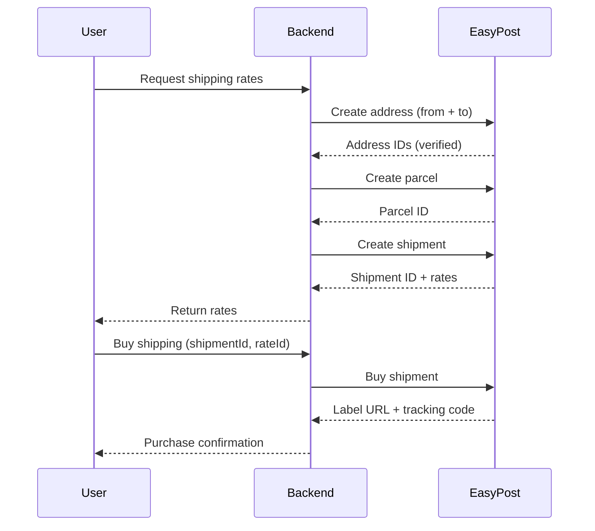

EasyPost is a shipping API that abstracts the complexity of multiple carriers (USPS, UPS,
FedEx, and more) behind a single integration. Droplinked uses it within the
`ShippingModule` for:

- Address verification
- Parcel creation
- Shipment creation and rate retrieval
- Purchasing shipping labels
- Tracking shipments

## Configuration

```env
EASY_POST_API_KEY=...
```

| Var | Notes |
|-----|-------|
| `EASY_POST_API_KEY` | Private API key from your EasyPost dashboard. Authenticates every request |

<Warning>
`EASY_POST_API_KEY` is sensitive and stored server-side only. Never expose it to the
client.
</Warning>

## Client initialization

The `EasyPostShippingService` initializes the client in its constructor using the
`@easypost/api` library:

```ts
this.easyPost = new EasyPostClient(apiKey, { timeout: 120000 });
```

## Reference docs

- [EasyPost API Documentation](https://docs.easypost.com/)

## API surface

### Address creation

Fields sent:

- `street1`, `street2`
- `city`, `state`, `zip`
- `country`
- `company`, `phone`, `email`

### Shipment creation

Fields sent:

- `to_address` — destination address ID
- `from_address` — origin address ID
- `parcel` — parcel ID
- `customs_info` — required for international shipments (contents type, etc.)

Returned:

- `id` — shipment ID
- `rates[]` — array of available rates, each with `id`, `carrier`, `service`, `rate`,
  `delivery_days`

### Buying a shipment

Fields sent:

- `shipment_id` — the shipment to buy
- `rate` — `{ id: rate_id }`, the specific rate selected

Returned:

- `tracking_code` — tracking number
- `postage_label` — URL to the shipping label image (PNG/PDF)
- `status` — current status (`pre_transit`, `in_transit`, `delivered`, …)

## What we store

| Field | Why |
|-------|-----|
| `shipment_id` | Reference the shipment later |
| `tracking_code` | Let customers track their package |
| `label_url` | Re-print the label on demand |
| `carrier` & `service` | Record-keeping and analytics |

## Flow diagram



## Security notes

<Steps>
  <Step title="API key protection">
    `EASY_POST_API_KEY` is server-only and stored in your secrets manager. Never inlined in
    client code or build output.
  </Step>
  <Step title="Address verification">
    EasyPost address verification runs **before** buying labels — reduces failed
    deliveries.
  </Step>
</Steps>

## Troubleshooting

| Symptom | Likely cause | Fix |
|---------|--------------|-----|
| `Service unavailable` | EasyPost API down or timing out | Client uses a 120s timeout; retry the request |
| `Rate not found` | `rate_id` invalid or expired | Refresh rates by creating a new shipment and selecting a fresh rate |
| Empty `availableShipping` on a US→US physical-only cart | Product mis-routed to a non-EasyPost strategy | See [Checkout stability — known regression](/guides/testing/checkout-stability) |

## Related

- [Order lifecycle](/guides/order-lifecycle)
- [Printful](/guides/integrations/printful) — the parallel path for POD goods.
- [Checkout stability](/guides/testing/checkout-stability) — shipping test matrix.
