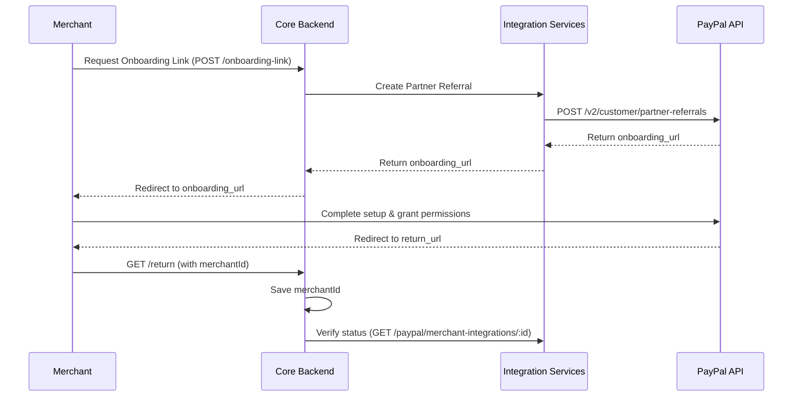
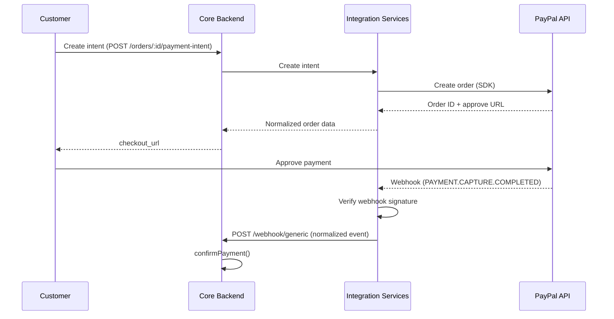

PayPal is implemented in two parts:

1. **Merchant onboarding** — registering and connecting seller accounts as Partners
2. **Payment gateway** — processing end-customer payments, creating orders, and managing
   webhooks

These services let the platform authenticate sellers and manage financial transactions.

## Configuration

```env
# General
PAYPAL_MODE=sandbox          # 'sandbox' or 'live'

# API credentials
PAYPAL_CLIENT_ID=...         # from PayPal Developer Dashboard
PAYPAL_SECRET=...            # client secret (a.k.a. PAYPAL_CLIENT_SECRET)

# Partner / onboarding
PAYPAL_PARTNER_ID=...        # your PayPal Partner ID
PAYPAL_BN_CODE=...           # Build Notation Code (attribution)

# Webhook
PAYPAL_WEBHOOK_ID=...        # ID of the listener configured in PayPal
```

| Var | Notes |
|-----|-------|
| `PAYPAL_MODE` | Determines the execution environment |
| `PAYPAL_CLIENT_ID` / `PAYPAL_SECRET` | Main API keys — must be kept secret |
| `PAYPAL_PARTNER_ID` | Used for Marketplace features and seller referrals |
| `PAYPAL_WEBHOOK_ID` | Essential for validating the signature of incoming webhooks |

## Two clients

| Surface | Library | Purpose |
|---------|---------|---------|
| **Onboarding** | Raw HTTP (`fetch`) | Token + Partner Referral management. Access tokens fetched dynamically per request |
| **Payment Gateway** | `@paypal/checkout-server-sdk` | Creating orders and financial transactions. SDK client configured for `SandboxEnvironment` or `LiveEnvironment` |

## Merchant onboarding

### 1. Create Partner Referral

- **Flow:** User → Core Backend → Integration Services → PayPal API
- **Internal endpoint:** `POST /paypal/partner-referrals`
- **PayPal endpoint:** `POST /v2/customer/partner-referrals`

```json
{
  "tracking_id": "merchant-695d341eb52f8c355adf558d",
  "partner_config_override": {
    "return_url": "https://dev.droplinked.com/analytics/account-settings",
    "return_url_description": "Return after onboarding"
  },
  "operations": [
    {
      "operation": "API_INTEGRATION",
      "api_integration_preference": {
        "rest_api_integration": {
          "integration_method": "PAYPAL",
          "integration_type": "THIRD_PARTY"
        }
      }
    }
  ],
  "products": ["EXPRESS_CHECKOUT"],
  "legal_consents": [
    { "type": "SHARE_DATA_CONSENT", "granted": true }
  ]
}
```

**Response** includes an `onboarding_url` to redirect the seller to.

### 2. Onboarding return (callback)

- **Flow:** PayPal → User redirect → Core Backend
- The Core Backend receives `merchantId` and `trackingId` in the URL and persists the
  `merchantId`.

<Note>
This step does **not** call the Integration Service.
</Note>

### 3. Verify merchant integration

- **Internal endpoint:** `GET /paypal/merchant-integrations/:merchantId`

Checks whether the merchant is fully authorized to receive payments.

```json
{
  "statusCode": 200,
  "status": "success",
  "data": {
    "payments_receivable": true,
    "capabilities": ["PAYPAL_CHECKOUT", "GUEST_CHECKOUT", "SEND_INVOICE"],
    "vetting_status": "SUBSCRIBED"
  }
}
```

If `payments_receivable === true` and `vetting_status !== 'DENIED'`, the Core Backend
enables the PayPal gateway for that shop.

## Payment & checkout

### Create payment intent

- **Internal endpoint:** `POST /payment-gateway/create-intent`

**Scenario A — merchant account connected.** Funds transfer directly or split:

```json
{
  "type": "paypal",
  "amount": 100,
  "currency": "USD",
  "description": "DROPLINKED Paypal Payment",
  "platform_fee_amount": 1,
  "metadata": {
    "orderId": "6981d32bcbfd8f75959dad9e",
    "intent": "CAPTURE",
    "return_url": "...",
    "cancel_url": "...",
    "merchantAccountId": "TXFGGV8K3267A",
    "transfer_to_paypal_account": 1
  }
}
```

**Scenario B — merchant account not connected.** Funds stay in the platform's primary
PayPal account:

```json
{
  "type": "paypal",
  "amount": 10,
  "currency": "USD",
  "description": "DROPLINKED Paypal Payment",
  "platform_fee_amount": 0.2,
  "metadata": {
    "orderId": "6981d82dcbfd8f75959dada9",
    "intent": "CAPTURE",
    "return_url": "...",
    "cancel_url": "...",
    "merchantAccountId": null,
    "transfer_to_paypal_account": 0
  }
}
```

### Webhook handling & normalization

- **Flow:** PayPal → Integration Services → Core Backend (`/webhook/generic`)

When the Integration Service receives a PayPal webhook, it validates the signature and
sends a normalized payload to the Core Backend:

```json
{
  "event": {
    "status": "COMPLETED",
    "orderId": "6981d32bcbfd8f75959dad9e",
    "transactionId": "PAYPAL-TX-ID",
    "transactionLink": "https://paypal.com/activity/payment/..."
  },
  "type": "paypal"
}
```

### Status mapping

| PayPal status | Core Backend action | Result |
|---------------|---------------------|--------|
| `COMPLETED` | `confirmPayment()` | Order confirmed, inventory updated, emails sent |
| `REFUNDED` | Update status | Order status → `REFUNDED` |
| `PENDING` | Update status | Payment status → `PENDING` |
| `FAILED` / `DENIED` | Update status | Payment status → `FAILED` |
| `CANCELLED` / `VOIDED` | Update status | Order status → `CANCELLED` |

## Flow diagrams

### Merchant onboarding



### Payment checkout



## Security notes

<Steps>
  <Step title="Webhook verification">
    All webhooks are validated using `paypal-transmission-sig` and `PAYPAL_WEBHOOK_ID`. The
    signature includes `transmissionId`, `timestamp`, `webhookId`, and the CRC32 of the
    request body.
  </Step>
  <Step title="Token management">
    A new access token is obtained for each onboarding request (Client Credentials Flow).
    No sensitive tokens are logged.
  </Step>
  <Step title="HMAC comparison">
    `crypto.timingSafeEqual` (or `safeCompareHmac`) is used to compare signatures and
    prevent timing attacks.
  </Step>
</Steps>

## Troubleshooting

| Symptom | Likely cause |
|---------|--------------|
| All webhooks rejected | `PAYPAL_WEBHOOK_ID` in env doesn't match the PayPal Dashboard settings |
| Currency mismatch error | `currency_code` doesn't match the seller's PayPal account settings |
| `401 Unauthorized` | Using sandbox keys in live (or vice versa) |

## Related

- [Order lifecycle](/guides/order-lifecycle)
- [Checkout stability](/guides/testing/checkout-stability)
