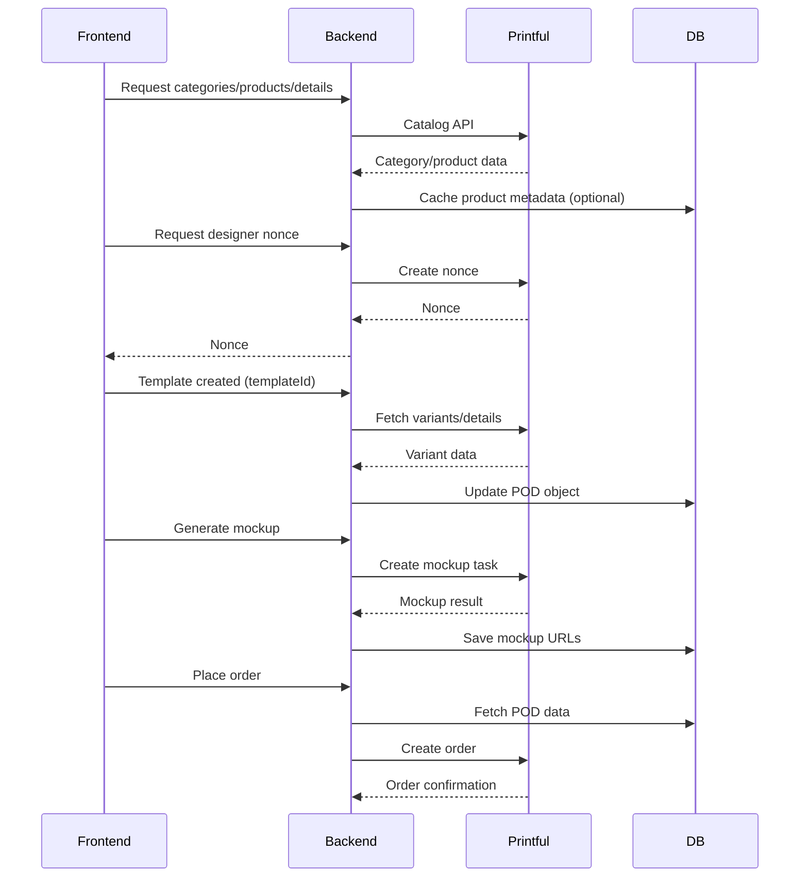

Printful is Droplinked's print-on-demand production and fulfillment service. The integration
covers catalog browsing, embedded design workflows, mockup generation, shipping rate
calculation, and order creation.

This integration powers the **POD** (Print-on-Demand) subsystem.

## Configuration

```env
PRINTFUL_API_KEY=...
PRINTFUL_STORE_ID=...
```

| Var | Where to get it |
|-----|-----------------|
| `PRINTFUL_API_KEY` | Printful admin dashboard → Settings → API |
| `PRINTFUL_STORE_ID` | Printful stores section |

<Warning>
These values are loaded server-side only. Never expose them to the frontend.
</Warning>

## Client initialization

The Printful client is initialized with `PRINTFUL_API_KEY` attached as a Bearer token,
shared across all Printful service modules.

## Reference docs

- [Printful general docs](https://developers.printful.com/docs/)
- [V2 Beta](https://developers.printful.com/docs/v2-beta/)
- [Embedded Designer (EDM)](https://developers.printful.com/docs/edm/)

## API surface

### Catalog

| Internal | Printful | Notes |
|----------|----------|-------|
| `GET /printful/categories` | `GET /categories` | id, parent_id, image_url, catalog_id, title |
| `GET /printful/products?categoryId=...` | `GET /categories/{id}` | id, variants, title, brand |
| `GET /pod/product/{id}` | `GET /products/{id}` | product, variants, files, options, techniques |
| `GET /printful/shipping/{id}` | `GET /v2/catalog-products/{id}/availability?selling_region_name=all` | availability, regions, warehouse_locations |

### Designer

| Internal | Printful | Notes |
|----------|----------|-------|
| `POST /printful/nonce` | `POST /embedded-designer/nonces` | Returns `nonce` + `expires_at`. Outgoing: `template_id` (optional), `scope` |
| `GET /pod/available-variants/{provider}/{productId}/{templateId}` | `GET /products/{id}` | Used after the designer creates a template |

### Mockups

| Internal | Printful |
|----------|----------|
| `POST /printful/generate/mockup` | `POST /mockup-generator/create-task/{id}` |

Returns `task_key`, `result_url`, `status`.

### Orders

- **Printful endpoint:** `POST /orders`
- **Sent:** `recipient`, `items[]`, `variant_id`, `files[]` (artwork URLs, positions,
  template references), `external_id`, `shipping`, `store_id`

### Shipping rates

- **Printful endpoint:** `POST /shipping/rates`
- **Sent:** `recipient.address`, `items[].quantity`, `items[].variant_id`
- **Returned:** `rate`, `carrier`, `service`, `minDeliveryDays` / `maxDeliveryDays`

## What we store (POD object)

```ts
type ProductPodV2 = {
  artwork: string | null
  artwork2: string | null
  artwork_position: string | null
  artwork2_position: string | null
  printful_template_id: number | null
  pod_blank_product_id: number | null
  prodviderID: string | null
  m2m_positions_options: ProductsM2MPositions[]
  m2m_positions: string[]
  m2m_services: string[]
  custome_external_id: string | null
  printful_option_data: PrintfulOptionData[]
  positions: ProductPodPositions | null
  technique: string | null
}
```

**Why we store it:**

- `artwork` / artwork positions — needed during Printful file upload at order creation
- `printful_template_id` — required to retrieve variant-specific print files
- `pod_blank_product_id` — core product ID for Printful orders
- `option/position` data — required for mockup generation + order fulfillment
- `technique` — printing method (DTG, sublimation, embroidery, etc.)

## Flow diagram



## Related

- [Order lifecycle](/guides/order-lifecycle) — where Printful slots into product processing.
- [EasyPost](/guides/integrations/easypost) — the parallel path for non-POD physical goods.
