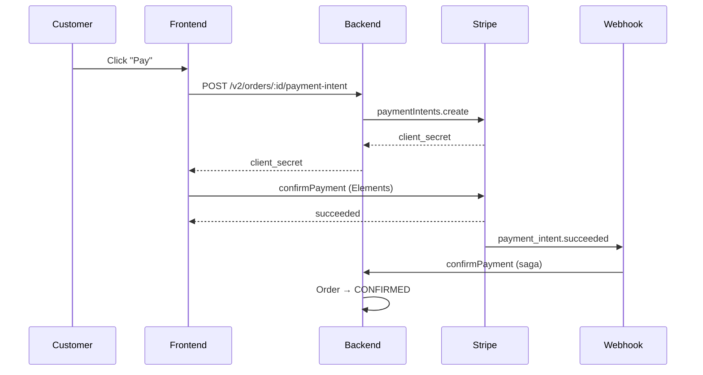

Stripe is Droplinked's default card-payment processor. It powers three flows:

1. **Merchant onboarding** — Connect (Standard accounts) so merchants receive funds in
   their own Stripe account
2. **Customer payments** — `PaymentIntent` per order, attached to the merchant's connected
   account or to the platform's primary account when the merchant isn't connected
3. **Subscription billing** — Stripe Checkout sessions for Droplinked's own SaaS plans

## Configuration

```env
STRIPE_SECRET_KEY=sk_live_...       # platform Stripe secret key
STRIPE_WEBHOOK_SECRET=whsec_...     # webhook signing secret
```

| Var | Notes |
|-----|-------|
| `STRIPE_SECRET_KEY` | Platform-level secret. Restricted keys with IP allowlist are recommended for production |
| `STRIPE_WEBHOOK_SECRET` | Used to verify webhook payloads from Stripe |

<Tip>
Use **test-mode** keys (`sk_test_...`) for the dev environment. Stripe issues a separate
webhook signing secret per endpoint per environment.
</Tip>

## Merchant onboarding (Stripe Connect Standard)

The platform creates a Standard Connect account for each merchant and returns a hosted
onboarding link.

### Create an account + onboarding link

```ts
async createAccount(userId: string, shopId: string): Promise<{ url: string }>
```

<Steps>
  <Step title="Look up shop + user">
    Resolve the user's email and the shop's existing `expressStripeAccountId` (if any).
  </Step>
  <Step title="Reject if already onboarded">
    If the shop already has an Express account, throws `BadRequestException` ("already
    onboarded").
  </Step>
  <Step title="Create the Stripe account">
    `stripe.accounts.create({ type: 'standard', email })`. Save the new account ID against
    the shop.
  </Step>
  <Step title="Return the onboarding link">
    `stripe.accountLinks.create()` with a return URL appropriate for the environment.
    Return the URL to the merchant.
  </Step>
</Steps>

### Webhook: `account.updated`

The platform listens for `account.updated` events. When `charges_enabled` **and**
`payouts_enabled` are both `true`, the shop's Stripe status is flipped to active.

```ts
async onboardWebhookHandler(body: Buffer, sig: string): Promise<boolean>
```

The handler:

1. Fetches the account-update endpoint secret from config
2. Constructs the event with `stripe.webhooks.constructEvent(body, sig, secret)` —
   verifying authenticity
3. If the event is `account.updated` and both capabilities are enabled, marks the shop
   active
4. Returns `true` on success; throws `BadRequestException` on verification failure

<Warning>
Always use the raw request body when verifying webhooks. Re-parsed JSON breaks the
signature.
</Warning>

## Customer payments

Per-order payments use the standard `PaymentIntent` flow. See [Order lifecycle](/guides/order-lifecycle)
for how this integrates with the order-confirmation saga.

| Step | Endpoint | What happens |
|------|----------|--------------|
| Create intent | `POST /v2/orders/:orderId/payment-intent` | Backend calls Stripe; returns `client_secret` |
| Customer pays | Stripe Elements on the storefront | Card charged client-side |
| Webhook | `payment_intent.succeeded` | Order moves to `CONFIRMED` via the saga |

### Connected-account vs platform charges

- **Merchant connected** — `payment_intent.create({ on_behalf_of, transfer_data })` so
  funds settle into the merchant's Stripe account; platform retains an application fee
- **Merchant not connected** — Payment captured into the platform's primary Stripe
  account; merchant payout reconciled out-of-band

## Subscription billing

Droplinked's own SaaS plans bill through Stripe Checkout (subscription mode). The
subscription gateway is exposed as integration-service endpoints called server-to-server
from the backend.

| Endpoint | Purpose |
|----------|---------|
| `POST /stripe/checkout` | Create a subscription-mode Checkout Session with on-the-fly `price_data` |
| `POST /stripe/coupon` | Create a one-time coupon (e.g. prorated upgrade credit) |
| `POST /stripe/cancel` | Cancel a subscription |

### Create a subscription checkout session

```json
{
  "lineItem": {
    "planName": "Pro",
    "description": "Pro plan, billed monthly",
    "priceInDollars": 49.99,
    "recurringInterval": "month",
    "recurringIntervalCount": 1
  },
  "metadata": {
    "shopId": "...",
    "planId": "...",
    "flow": "upgrade"
  },
  "successUrl": "https://droplinked.com/subscribe/success",
  "cancelUrl": "https://droplinked.com/subscribe/cancel",
  "trialPeriodDays": 0,
  "couponId": null
}
```

Returns `{ checkoutUrl, sessionId }`. Redirect the merchant to `checkoutUrl`.

<Note>
Stripe metadata values must be strings — the gateway drops `null`/`undefined` entries
before sending.
</Note>

## Webhook signature verification

All webhook handlers (account update, payment-intent succeeded, charge refunded, etc.) use
`stripe.webhooks.constructEvent` to validate the `Stripe-Signature` header against the
endpoint secret. A failed verification returns `400` and is never processed.

For replay safety and the broader webhook test matrix, see
[Checkout stability](/guides/testing/checkout-stability).

## Flow diagram — customer payment



## Troubleshooting

| Symptom | Likely cause |
|---------|--------------|
| `signature verification failed` | Wrong webhook secret, or middleware re-parsed the body before verification |
| `account.updated` not arriving | Endpoint not registered for that event, or restricted key blocked at IP allowlist |
| `payment_intent` succeeds but order stays `PENDING` | Webhook reaching `/webhook/stripe`? Check the saga logs; replay safe |
| `403` from Stripe | Restricted key + missing IP allowlist entry for the calling runner |

## Related

- [Order lifecycle](/guides/order-lifecycle)
- [Checkout stability](/guides/testing/checkout-stability)
- [Environment variables](/guides/environment-variables)
