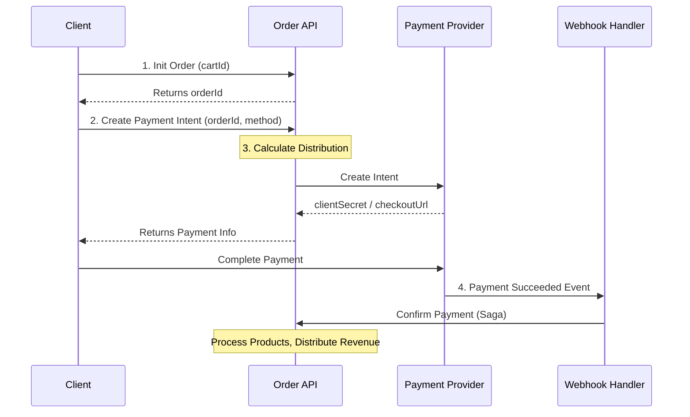

Every Droplinked order moves through four phases: **init**, **payment intent**, **distribution
calculation**, and **confirmation**. Phases 1–3 are synchronous request/response; phase 4 is
driven by a payment-provider webhook.

## High-level sequence

## 1. Initialize order

- **Endpoint:** `POST /v2/orders`
- **Input:** `cartId` (UUID)

The API snapshots the current cart state (items, shipping, totals), creates a generic `Order`
record in `PENDING` status, and **locks the cart** to prevent further changes.

**Returns:** `orderId`

## 2. Create payment intent

- **Endpoint:** `POST /v2/orders/:orderId/payment-intent`
- **Input:** `orderId`, `paymentMethod` (e.g. `STRIPE`, `PAYPAL`, `CRYPTO`, `BONUM`, `TELR`)

The API validates the order is pending, runs the distribution calculation (step 3), then
contacts the payment provider to create a payment intent. Distribution metadata (splits +
`orderId`) is attached to the provider's intent so reconciliation can happen later.

**Returns:** `clientSecret` (Stripe) or `checkoutUrl` (PayPal, hosted PSPs).

## 3. Calculate distribution (internal)

Runs synchronously inside step 2. Computes:

- **Droplinked commission** — platform fee
- **Provider fees** — pass-through PSP charges
- **Merchant share** — what settles to the merchant
- **Affiliate / referral splits** — when an attribution session is active

This determines exactly how funds will be split **before** the payment is initialized.

<Note>
For PSPs that settle off-platform (e.g. Bonum), the saga records the split plan without
executing a live transfer — settlement happens out-of-band and is reconciled later.
</Note>

## 4. Confirm payment

- **Endpoint:** `POST /v2/orders/:orderId/confirm-payment`
- **Trigger:** Webhook event (e.g. `stripe.payment_intent.succeeded`)

The webhook handler verifies the signature, then executes the **confirmation saga**:

<Steps>
  <Step title="Validate">
    Checks order status; rejects if already terminal.
  </Step>
  <Step title="Process products">
    Routes each line item to the right fulfillment path — POD via [Printful](/guides/integrations/printful),
    physical via [EasyPost](/guides/integrations/easypost), and digital items get their
    delivery handled inline.
  </Step>
  <Step title="Distribute revenue">
    Executes the splits calculated in step 3 (or records them for off-platform settlement).
  </Step>
  <Step title="Finalize">
    Updates order status to `CONFIRMED`.
  </Step>
</Steps>

## Idempotency guarantees

<Tip>
Every webhook handler is **idempotent**: replays return 200 without re-processing. State
machines are forward-only — a stale `AUTHORIZED` event arriving after `CAPTURED` is dropped
rather than rewinding the order.
</Tip>

For the full webhook + replay matrix, see [Checkout stability](/guides/testing/checkout-stability).

## Related

- [Payment integrations overview](/guides/integrations/stripe)
- [Checkout stability playbook](/guides/testing/checkout-stability)
